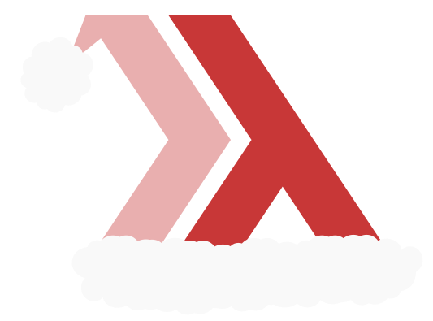

# :star: Advent of Code 2022 :star:

  

Dashing through the code, in a Haskell way  
Solving puzzles left and right, on this coding day  
With a notebook and a pen, and a sharp mind to boot  
We're hacking our way through, with Haskell as our root  

Oh, jingle bells, jingle bells,  
Writing Haskell code all the way  
Oh, what fun it is to code,  
In a functional way  

We pattern match and we compose,  
We abstract and we generalize  
We use higher-order functions,  
And a rich set of libraries  

We catch errors on the fly,  
With the help of the type system  
We avoid boilerplate,  
And make our code more rhythmic  

Oh, jingle bells, jingle bells,  
Writing Haskell code all the way  
Oh, what fun it is to code,  
In a functional way  

So here's to Advent of Code,  
And to Haskell, our language of choice  
May our solutions be elegant,  
And our spirits never lose their voice  

Oh, jingle bells, jingle bells,  
Writing Haskell code all the way  
Oh, what fun it is to code,  
In a functional way.  

> chat.openai.com
